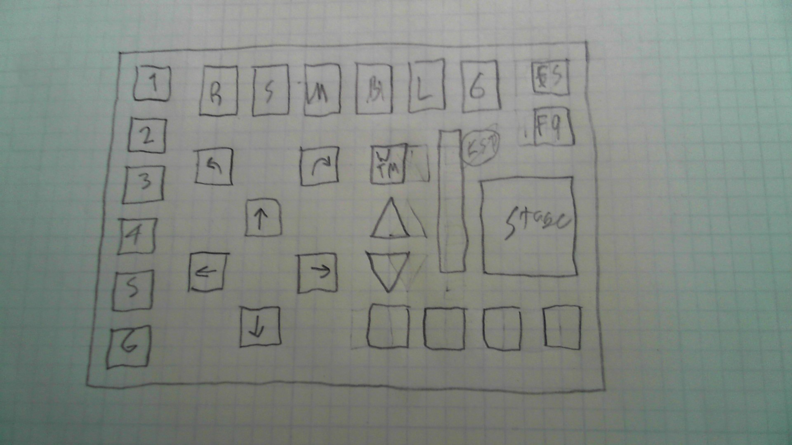

# Kerbal Kontroller

This is a external controller for the game Kerbal Space Program you need a [Artemis ATP](https://www.sparkfun.com/products/15442), [Artemis Module](https://www.sparkfun.com/products/15484), or any other board with ~30 digital interupts(Why did we write the code like this, hope to get Arduino Mega suport soon). 

# Table of Contents

* [Design](#design)
* [Built it yourself](#Built-it-yourself)
* [Files](#File-system)

# Design

## Chosing which pins to include

After a little research on past designs for a kerbal controller we found that we wanted one that was bigger and used more high quality switches. After some frequency research(Playing KSP) we found that you pressed these buttons

* Throttle Up
* Cut Throttle
* Fine Throttle Control(Dial or Slide Potentiometer)
* Action groups
* WASD + Roll
* SAS Options
* Stage
* Quick Save
* Revert Buttons
* Manuver buttons
* Time Warp

We looked at this list and thought that it would be to many pins(~45) to implement on one arduino or RPi and we narrowed it down to this list

* Stage
* Throttle Dial
* WASD + Roll
* Action Groups(6)
* Internal Action groups
* SAS, RCS, Modable switch
* Quick Save, Revert save
* 4 Mod buttons

These buttons and switches took up about 25 pins so they could fit easly on one arduino so we moved on to designing the layout of the board. 

## Designing the layout

### First design

For our fist design we wanted to have a big board 30cm wide and 20cm tall, it was going to be huge! We kept adding on to this design and ended up with this design in this design we added 5 modable buttons for different buttons on the keyboard that the end user could change.

We worked on thsi design for a while and created 2 prototypes in [this folder](Design/v.1) or [this folder](Design/v.2) We found that this design was going to be way too big and changed over to our much smaller second design 

### Second and Final Design

On our second design we got rid of the huge time warp selector, although helpful used up too many pins and could be a lot smaller. for this design we designed the layout of the buttons and switches then chose the size of the plexiglass we wanted

This was a much smaller form factor and only have 22 buttons, 6 switches and one analog gauge, for a total of 28 digital pins, and only on analog pins. 

After we finnished the design we wanted to have a to scale model. we wanted some costomizablity for a flat design or a proped up design this is our first prototype of a proped up design

Front

Side

Proped up

We found that this would be the perfect size for our kerbal controller.

# Software

After doing some research on KSP mods for kerbal controllers we found this [post](https://www.reddit.com/r/KerbalControllers/comments/ajavos/software_comparison_thread/) on the different ways to do it can after looing at the pros and cons of each of them we thought that Kerbal Simpit would be the best for cosntomizablity and ease of use.

# Built-it-yourself

Look at our [website](https://hdprojects.dev/ksp/diy)

# File-system

### CAD Section

This is split into three parts 

* v.1
    * v.1 was our first design for our kerbal controller.
* v.2
    * v.2 was the same design just we totally redid the CAD Model to fix the many errors we had before.
* Final 
    * This is the only totally finnished design that would acctually work if you tried it.
